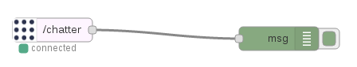

#Info

This project provides a way to make a DevOps in robotics. Documentation at https://cocheok.github.io/robotics_devops

# Prerequisites

Install [Docker](https://docs.docker.com/engine/installation/)

# Configuration
## 1. Build ros_base image
```
cd ros
docker build -t ros_base .
cd ..
```

## 2. Build rosbridge image
```
cd rosbridge
docker build -t rosbridge .
cd ..
```

## 3. Build nodered image
```
cd nodered
docker build -t nodered_base .
cd ..
```

# Talker Listener example

This is example has the following structure:


## 1. Run the talker-listener example
```
cd demos/talker-listener
docker-compose up            
```
## 2. Look for node-red url
In another window 
###2.1 List the docker containers             
```
docker ps
```
There are one that has the node_red in his name (The node-red container has a name like talkerlistener_nodered_1).

###2.2 Inspect the node-red container and get the url

replace the <node-red container> with the node-red container of the step 2.1 
```
docker inspect <node-red container>
```
##3 Use node-red
Open your browser and put the ip obtained on the point 2.2. The service is running on port 1880.
The topic that is used by the talker node is **/chatter** 

### 3.1 Consume messages from **/chatter** topic
	
#### 3.1.1 Put the **ROS sub** node from the input section and the **debug** node from the output section on the board and connect them



#### 3.1.2 Configure **ROS sub** node with the following content:
 
 -> ROS Server:  **ws://rosbridge:9090**
 
 -> Topic: **/chatter**

#### 3.1.3 Configure debug:

 -> Output: complete msg object 

#### 3.1.4 Click on **Deploy** and see messages on debug tab


### 3.2 Publish messages on **/chatter** topic 

#### 3.2.1 Put the **ROS pub** node from the output section and the **inject** node from the input section on the board and connect them


#### 3.2.2 Configure **ROS pub** node with the following content:                                                             

 -> ROS Server:  **ws://rosbridge:9090**

 -> Topic: **/chatter**

#### 3.1.3 Configure inject: 

 -> On Payload select type string and put the text "Test from node-red"

#### 3.1.4 Click on **Deploy**, then on the blue button of inject and see messages on debug tab
 

Flow
[{"id":"5848c162.48fa6","type":"tab","label":"Flow 1","disabled":false,"info":""},{"id":"be2b815f.a990b","type":"inject","z":"5848c162.48fa6","name":"","topic":"Test","payload":"Test node-red","payloadType":"str","repeat":"","crontab":"","once":false,"onceDelay":0.1,"x":150,"y":360,"wires":[["30696466.ce8f74"]]},{"id":"618d0bad.17be14","type":"debug","z":"5848c162.48fa6","name":"","active":false,"tosidebar":true,"console":false,"tostatus":false,"complete":"payload.data","x":480,"y":140,"wires":[]},{"id":"66b446ff.6d91d","type":"ros-subscribe","z":"5848c162.48fa6","server":"c7030e4e.0c461","topicname":"/chatter","x":190,"y":120,"wires":[["618d0bad.17be14"]]},{"id":"30696466.ce8f74","type":"ros-publish","z":"5848c162.48fa6","server":"c7030e4e.0c461","topicname":"/chatter","msgtype":"std_msgs/String","x":470,"y":360,"wires":[]},{"id":"c7030e4e.0c461","type":"ros-server","z":"","url":"ws://rosbridge:9090"}]
