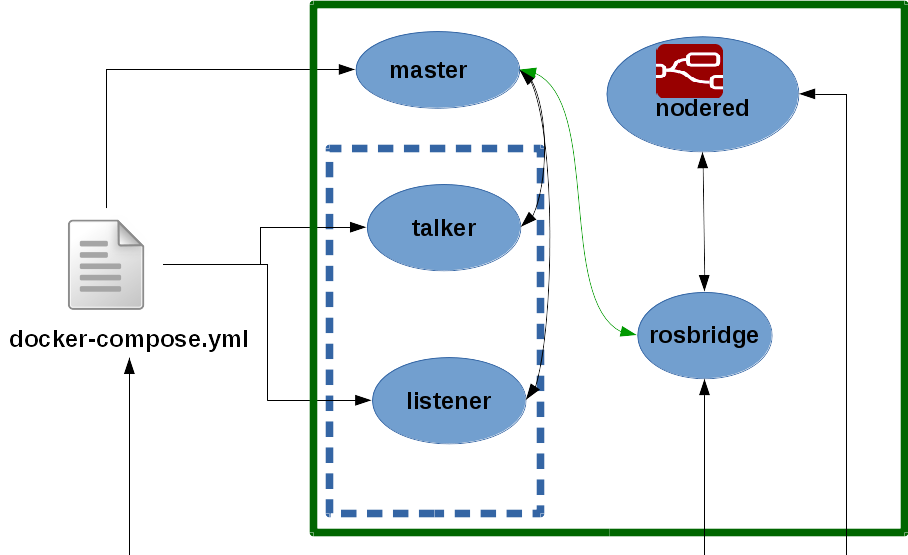

# Prerequisites

## 1. Install and configure [Docker](https://docs.docker.com/engine/installation/)
## 2. Get the code
```
git clone https://github.com/cocheok/robotics_devops.git
```

# Configuration
## 1. Build ros-base image
```
cd ros
docker build -t ros_base .
cd ..
```

## 2. Build nodered image
```
cd nodered_base
docker build -t nodered_base .
cd ..
```

# Talker Listener example

This is example has the following structure:


## 1. Run the talker-listener example
```
cd demos/talker-listener
docker-compose up            
```
## 2. Look for node-red url
In another window 
###2.1 List the docker containers             
```
docker ps
```
There are one that has the node_red in his name (The node-red container has a name like talkerlistener_nodered_1).

###2.2 Inspect the node-red container and get the url

replace the <node-red container> with the node-red container of the step 2.1 
```
docker inspect <node-red container>
```
##3 Use node-red
Open your browser and put the ip obtained on the point 2.2. The service is running on port 1880.


