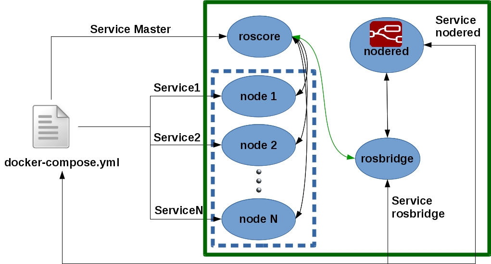
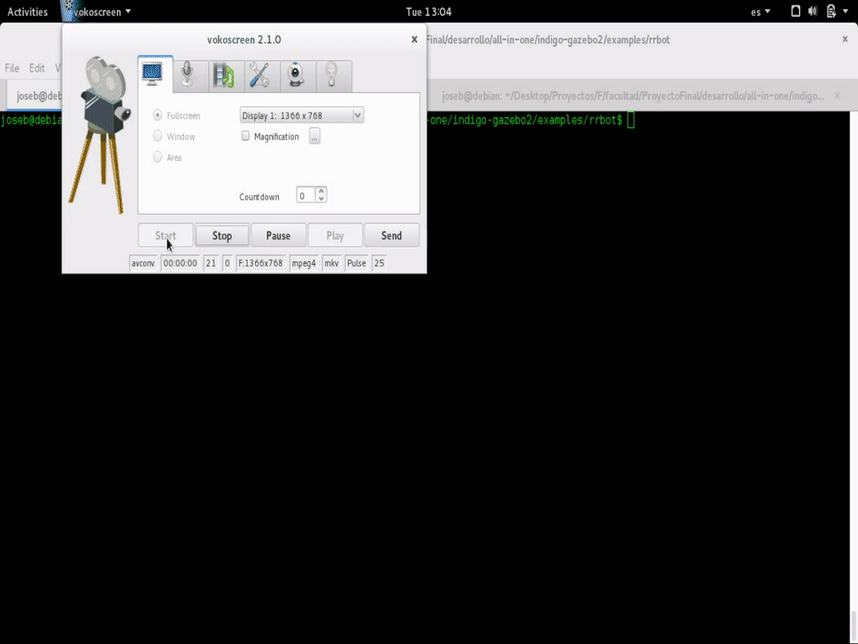
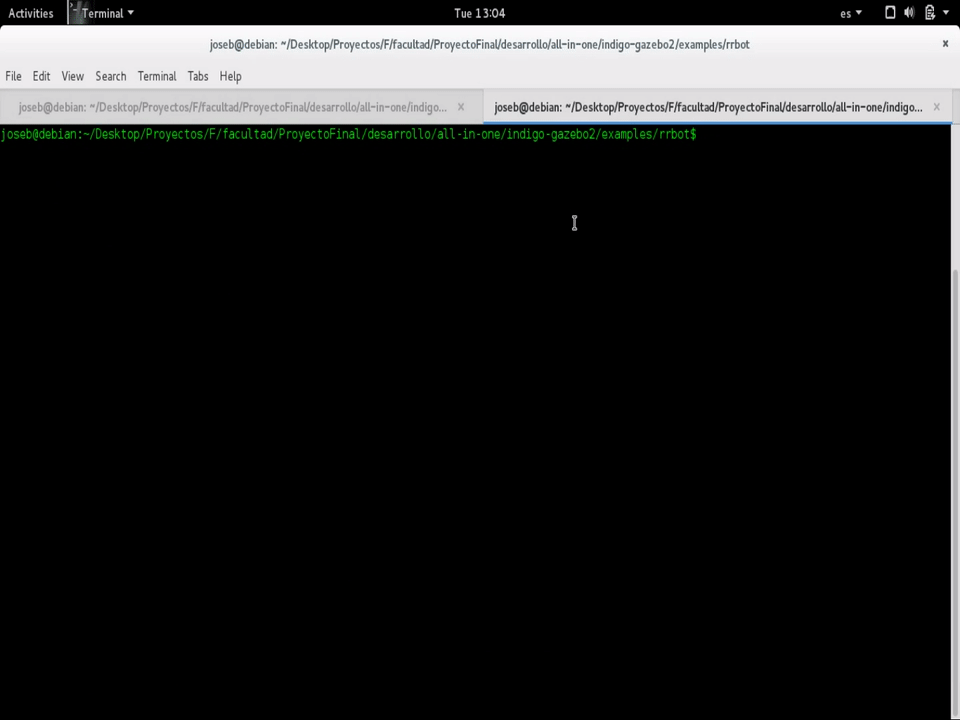
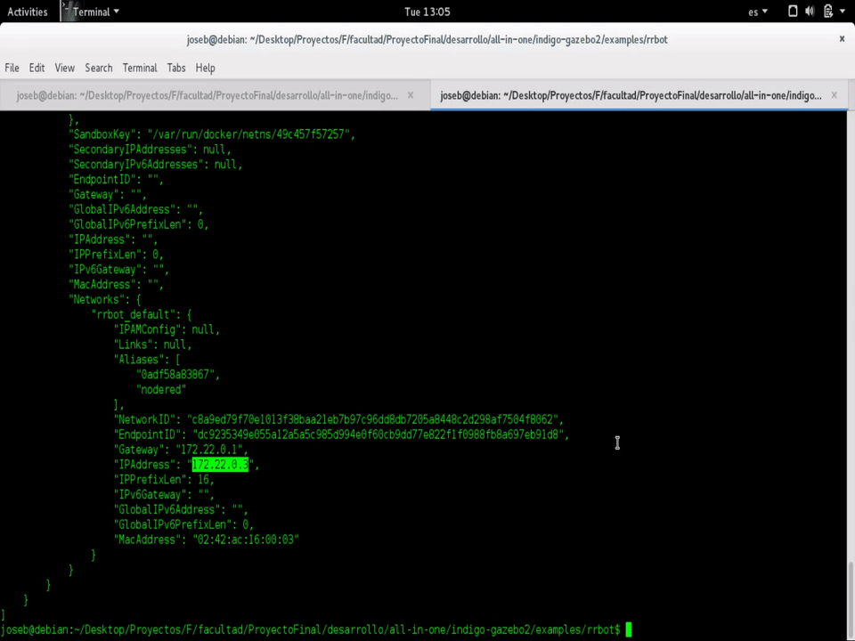

# Overview

We use Docker Compose to run complex multi container apps on a device that runs linux ( Raspberry Pi, X64).

# Deploy
Our multi-container deploy solution has the following structure:
 
 


As we can see, the containers has different kind of services:

  * ROS node
  * node-red
  * rosbridge
  * etc  
 
# Using node red

In one hand we have ROS that his nodes makes his communication using roscore (that is the core service). Over roscore the nodes that are registered comunicates each other using tipics and services. 
On the other hand we have Node-Red that offer a web page to make flows. To post messages on ROS topics we can make a node-red node that uses the roslibjs to comunicate via websocket using rosbridge. Using this concept a node-red node can use topics or services that ROS publish. 


##Example

In the following image we can see an example of a talker node that recives of an input node "2222" and publishes into the topic /st and then a listener node that is subscrived on the /st topic and debug the recived message on the debugger console.

The node-red module is: 
```node-red-contrib-ros```

The flow is: 
```
[{"id":"f31cee7d.0ce31","type":"ros-server","z":"a1c6eb3b.5e3918","url":"ws://localhost:9090/"},{"id":"b44e0788.4bb1f8","type":"inject","z":"a1c6eb3b.5e3918","name":"","topic":"","payload":"2222","payloadType":"str","repeat":"","crontab":"","once":false,"x":111.5,"y":232,"wires":[["c2a8605a.3d57a"]]},{"id":"bbb8147a.4447e8","type":"ros-subscribe","z":"a1c6eb3b.5e3918","server":"f31cee7d.0ce31","topicname":"/st","x":112.5,"y":129,"wires":[["b8bcdc13.47432"]]},{"id":"b8bcdc13.47432","type":"debug","z":"a1c6eb3b.5e3918","name":"","active":true,"console":"false","complete":"true","x":333.5,"y":163,"wires":[]},{"id":"c2a8605a.3d57a","type":"ros-publish","z":"a1c6eb3b.5e3918","server":"f31cee7d.0ce31","topicname":"/st","msgtype":"std_msgs/String","x":288.5,"y":264,"wires":[]}]
```


###Step 1: start the services

```docker-compose up```

 

###Step 2: look for the node-red url 
```docker inspect <container>```

 

###Step 3: Execute the flow in node-red and check that is sending messages over ROS

 
